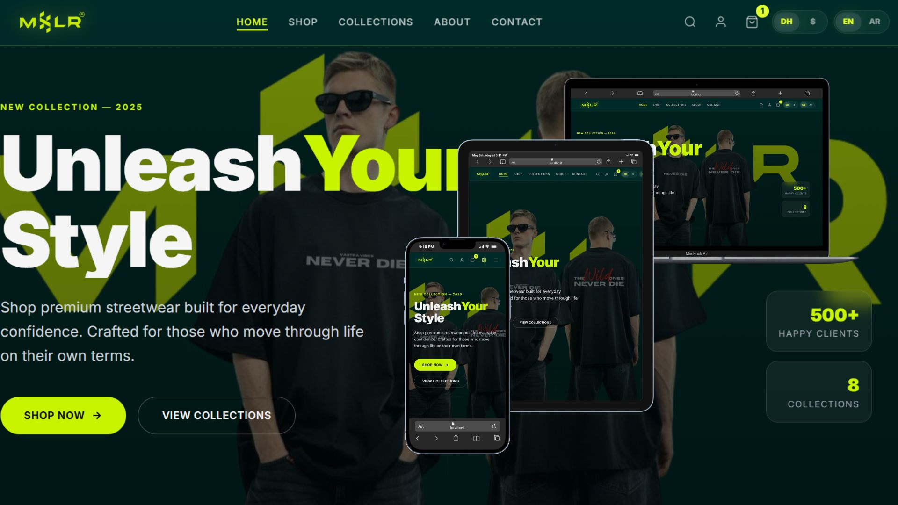

# MSLR – Premium Streetwear E‑Commerce 



##  Project Overview
MSLR is a high‑end streetwear e‑commerce website designed to deliver a premium shopping experience. It supports bilingual (English/Arabic) interfaces, multiple currencies (DH, USD), and integrates modern animations with **Anime.js** for a dynamic, engaging UI.

##  Features
- ** Shopping Cart** – Add, edit, and remove items with smooth UI feedback.
- ** WhatsApp Checkout** – One‑click order confirmation via WhatsApp.
- ** Currency Switcher** – Toggle between Moroccan Dirham (DH) and US Dollar (USD).
- ** Language Switcher** – Seamless switch between English (EN) and Arabic (AR) with RTL support.
- ** Mobile‑Responsive** – Fully responsive layout for all devices.
- ** Anime.js Animations** – Subtle entrance, hover, and scroll animations.
- ** RTL Arabic Support** – Proper layout, typography, and mirroring for Arabic.
- ** Future‑Proof** – Easy to extend with additional languages, payment gateways, and product categories.

##  Tech Stack
- **HTML5** – Semantic markup for accessibility and SEO.
- **Tailwind CSS** – Utility‑first styling with dark‑mode and glassmorphism.
- **Vanilla JavaScript** – Lightweight interactivity without framework overhead.
- **Anime.js** – Powerful animation library for smooth UI effects.

##  Folder Structure
```
webStore/
├─ index.html               # Home page
├─ checkout.html            # WhatsApp checkout page
├─ cart.html                # Shopping cart page
├─ js/
│   └─ app.js              # Core JS logic (cart, switchers, animations)
├─ css/
│   └─ tailwind.css        # Tailwind build output
├─ assets/
│   ├─ images/             # Product & UI images
│   └─ icons/              # SVG icons, logo, etc.
└─ README.md                # 📄 This file
```

##  Shopping / Cart System
Implemented in `js/app.js`:
- Add items to cart with localStorage persistence.
- Update quantities, calculate totals, and display cart badge.
- Responsive cart modal for desktop and slide‑in drawer for mobile.

##  WhatsApp Checkout
- Generates a pre‑filled message containing order details.
- Opens WhatsApp Web or the mobile app via a `wa.me` link.
- No server‑side processing required – ideal for small‑scale premium brands.

##  Currency Switcher (DH / USD)
- UI toggle in the header.
- Prices are stored in a base currency and converted on‑the‑fly.
- User preference saved in `localStorage`.

##  Language Switcher (EN / AR)
- Button toggles `lang` attribute on `<html>`.
- CSS variables adjust direction (`direction: rtl`) and font families.
- All static text is stored in a JSON dictionary for easy extension.

##  Mobile‑Responsive Support
- Tailwind's responsive utilities (`sm:`, `md:`, `lg:`) ensure fluid layouts.
- Navigation collapses into a hamburger menu.
- Touch‑friendly buttons and larger tap targets.

##  Anime.js Animations
- Hero section fade‑in and slide‑up on page load.
- Product cards animate on scroll (`scrollTrigger`).
- Button hover effects with subtle scaling and color transitions.

##  RTL Arabic Support
- `dir="rtl"` applied when Arabic is active.
- Tailwind custom utilities for mirrored margins/paddings.
- Arabic‑specific typography (e.g., `font‑family: "Cairo", sans‑serif`).

##  Future Improvements
- ** Add a full‑featured product catalog** with pagination.
- ** Secure payment gateway integration** (Stripe, PayPal).
- ** Admin dashboard** for inventory and order management.
- ** Analytics** integration (Google Analytics, Hotjar).
- ** Component library** extraction for reusability across projects.

##  Author
**Your Name** – Front‑end Engineer & UI/UX Designer
- GitHub: [simo-SM](https://github.com/simo-SM)
- LinkedIn: [Your Name](https://linkedin.com/in/yourprofile)
- Email: youremail@example.com

---
*Built with passion for premium streetwear brands.*
